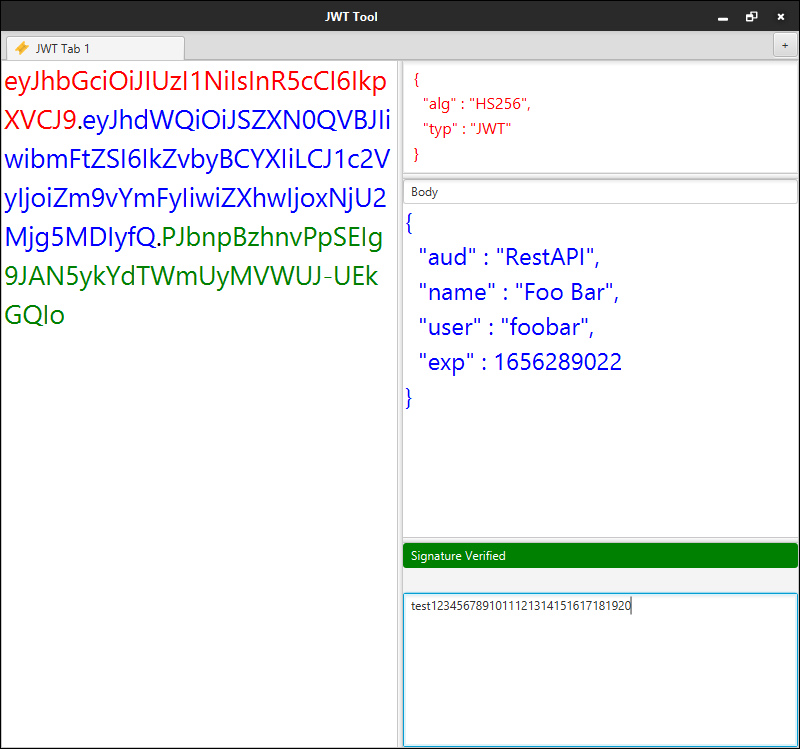

<h1> jwt-fx </h1>
Multi-Tabbed JWT Token Debugger Written using <strike>JavaFX 11</strike> JavaFX 17


#Screenshot




<h2>Building</h2>

```
mvn clean package 
```

Distributions  (.zip or .tar.gz) can be found under dist/target folder
